# Дипломная работа по профессии «Системный администратор»

### Автор: Беляева Евгения

---

## Содержание

- [Задача](#задача)
- [Инфраструктура](#инфраструктура)
- [Сеть](#сеть)
- [Виртуальные машины](#виртуальные-машины)
- [Сайт](#сайт)
- [Мониторинг (Zabbix)](#мониторинг-zabbix)
- [Логи (Elasticsearch + Kibana)](#логи-elasticsearch--kibana)
- [Резервное копирование](#резервное-копирование)
- [Terraform-файлы проекта](#terraform-файлы-проекта)
- [Ansible-плейбуки](#ansible-плейбуки)

---

## Задача

Ключевая задача — разработать отказоустойчивую инфраструктуру для сайта, включающую мониторинг, сбор логов и резервное копирование основных данных. Инфраструктура размещается в Yandex Cloud.

---

## Инфраструктура

Для развёртки инфраструктуры использовались **Terraform** и **Ansible**.

| Инструмент | Версия |
|---|---|
| Yandex Cloud CLI | 1.16.0 |
| Terraform | 1.16.0 |
| Ansible | 2.10.7 |
| ОС рабочей станции | Windows 10 |
| ОС виртуальных машин | Ubuntu 22.04 LTS |

---

## Сеть

Развёрнут один VPC — `diplom-network`.

**Подсети:**

| Имя | Зона | CIDR | Тип |
|---|---|---|---|
| public-a | ru-central1-a | 192.168.10.0/24 | Публичная |
| public-b | ru-central1-b | 192.168.11.0/24 | Публичная |
| private-a | ru-central1-a | 192.168.20.0/24 | Приватная |
| private-b | ru-central1-b | 192.168.21.0/24 | Приватная |

Для исходящего доступа ВМ в приватных подсетях настроен **NAT-шлюз** и таблица маршрутизации.

**Bastion host** — ВМ с публичным IP (51.250.73.102), открыт только порт SSH (22). Используется как jump-host для доступа к ВМ в приватных подсетях. Ansible установлен непосредственно на bastion host.

**Облачные сети:**

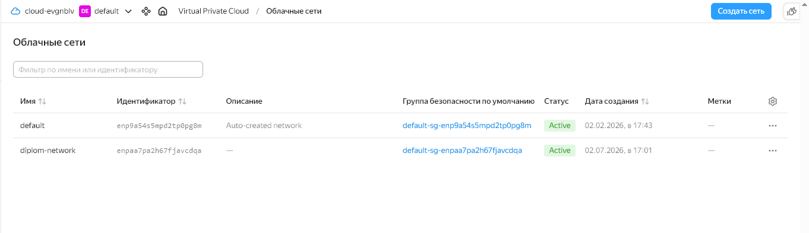

*Рис. 1 — Консоль Yandex Cloud: облачные сети. Создана сеть `diplom-network` для размещения всей инфраструктуры проекта.*

**Security Groups** настроены для каждого сервиса, ограничивая входящий трафик только нужными портами:

| Security Group | Входящие порты |
|---|---|
| bastion-sg | 22 (SSH) |
| web-sg | 80 (HTTP), 22 (SSH из публичной подсети), 10050 (Zabbix Agent) |
| zabbix-sg | 80 (Web UI), 10051 (Zabbix Server), 22 (SSH) |
| elastic-sg | 9200 (Elasticsearch), 22, 10050 |
| kibana-sg | 5601 (Kibana), 22, 10050 |
| alb-sg | 80, 443, healthchecks |

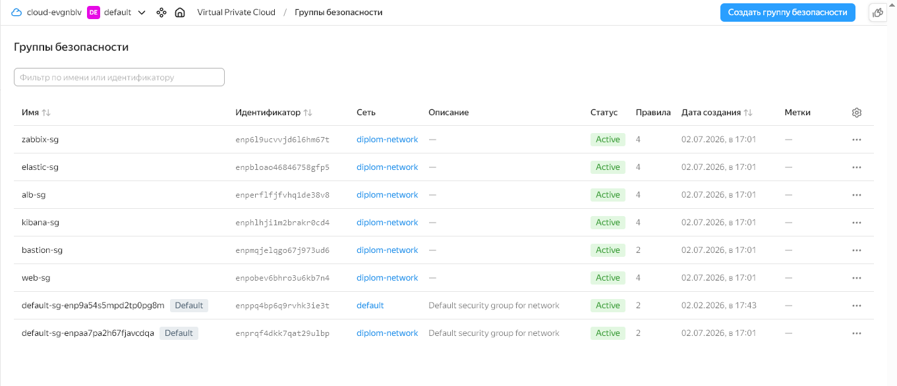

*Рис. 2 — Консоль Yandex Cloud: группы безопасности. Для каждого сервиса создана отдельная Security Group с правилами входящего трафика, ограниченными только необходимыми портами.*

---

## Виртуальные машины

Все ВМ: 2 ядра (20% Intel Ice Lake), 2–4 ГБ RAM, 10 ГБ HDD, Ubuntu 22.04 LTS, прерываемые.

| Имя | Зона | Подсеть | Публичный IP | Назначение |
|---|---|---|---|---|
| bastion | ru-central1-a | public-a | 51.250.73.102 | SSH jump host |
| web-1 | ru-central1-a | private-a | — | Веб-сервер nginx |
| web-2 | ru-central1-b | private-b | — | Веб-сервер nginx |
| zabbix | ru-central1-a | public-a | 89.169.154.238 | Мониторинг Zabbix |
| elastic | ru-central1-a | private-a | — | Elasticsearch |
| kibana | ru-central1-a | public-a | 51.250.78.121 | Kibana |

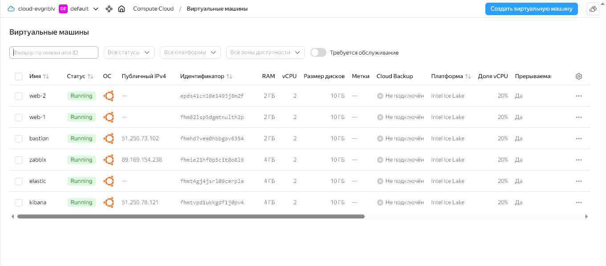

*Рис. 3 — Консоль Yandex Cloud: список виртуальных машин. Все 6 ВМ в статусе Running. Веб-серверы и Elasticsearch размещены в приватных подсетях (без публичного IP), остальные сервисы — в публичных.*

---

## Сайт

Созданы две ВМ (`web-1`, `web-2`) в разных зонах доступности в приватных подсетях. На обеих установлен **nginx** с помощью Ansible.

### Балансировщик нагрузки (ALB)

- **Target Group** — включены web-1 (192.168.20.16) и web-2 (192.168.21.34)
- **Backend Group** — healthcheck на `/`, порт 80, протокол HTTP
- **HTTP Router** — маршрут `/` → backend group
- **Application Load Balancer** — listener на порт 80, публичный IP: 158.160.216.69

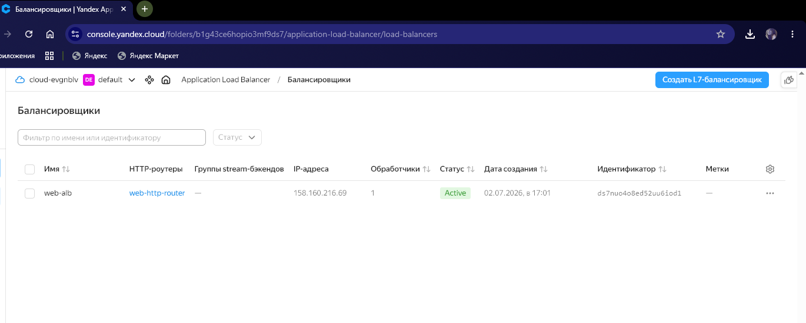

*Рис. 4 — Консоль Yandex Cloud: Application Load Balancer `web-alb` в статусе Active. Балансировщик привязан к HTTP-роутеру `web-http-router`, публичный IP — 158.160.216.69.*

### Проверка работоспособности

```
curl -v http://158.160.216.69:80
```

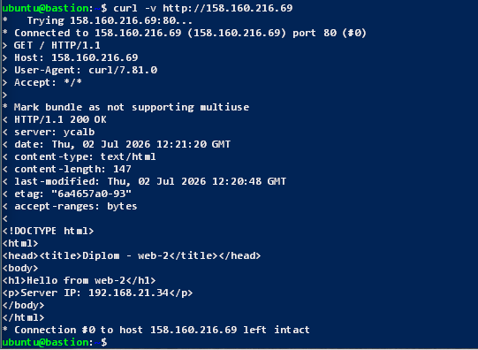

*Рис. 5 — Результат выполнения `curl -v` к публичному IP балансировщика. Получен ответ HTTP/1.1 200 OK от сервера ycalb (Yandex Cloud ALB). Страница отдана с web-2, что подтверждает работу балансировки трафика между двумя веб-серверами.*

---

## Мониторинг (Zabbix)

На ВМ `zabbix` (89.169.154.238) развёрнут **Zabbix Server 7.0.27** + Frontend (Apache) + PostgreSQL.

Доступ к веб-интерфейсу: http://89.169.154.238/zabbix

### Установка Zabbix

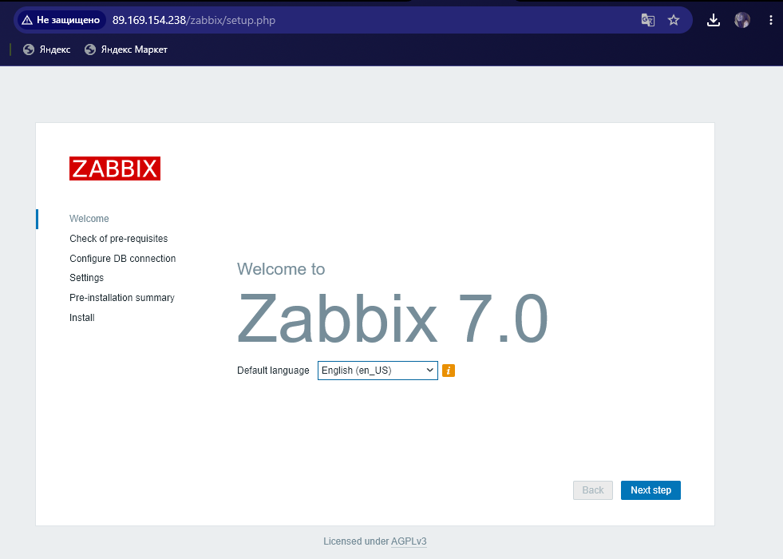

*Рис. 6 — Мастер установки Zabbix 7.0. Первоначальная настройка веб-интерфейса Zabbix через браузер по адресу http://89.169.154.238/zabbix.*

### Главный дашборд

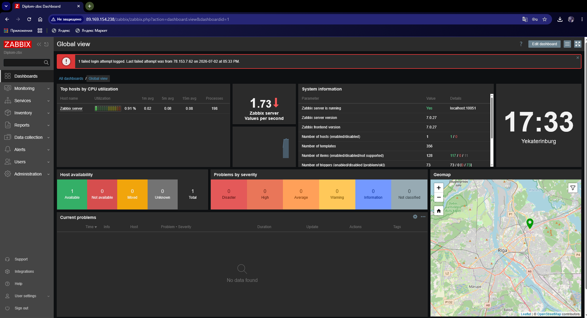

*Рис. 7 — Главный дашборд Zabbix (Global view). Zabbix Server запущен и работает (версия 7.0.27), принимает 1.73 значения в секунду. Отображается информация о хостах, шаблонах, триггерах и текущих проблемах.*

### Хосты с Zabbix Agent

На все ВМ установлен **Zabbix Agent** с помощью Ansible. Агенты настроены на отправку метрик на Zabbix Server (192.168.10.25). Все хосты используют шаблон `Linux by Zabbix agent`.

| Хост | IP | Статус |
|---|---|---|
| web-1 | 192.168.20.16 | ZBX ✅ |
| web-2 | 192.168.21.34 | ZBX ✅ |
| elastic | 192.168.20.25 | ZBX ✅ |
| kibana | 192.168.10.19 | ZBX ✅ |
| Zabbix server | 127.0.0.1 | ZBX ✅ |

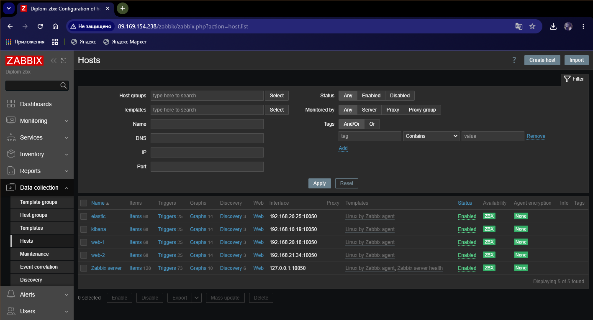

*Рис. 8 — Zabbix: список хостов (Data collection → Hosts). Все 5 хостов в статусе Enabled с зелёным индикатором ZBX, что подтверждает успешное подключение Zabbix Agent на каждой ВМ. Каждый хост использует шаблон `Linux by Zabbix agent` с 68 элементами данных, 25 триггерами и 14 графиками.*

### Дашборд USE Metrics

Настроен дашборд с отображением метрик по принципу USE для веб-серверов:

- **CPU utilization** (web-1, web-2)
- **Memory utilization** (web-1, web-2)
- **Network traffic** — Bits received/sent (web-1, web-2)
- **Disk space usage** — FS [/] Space Used (web-1, web-2)

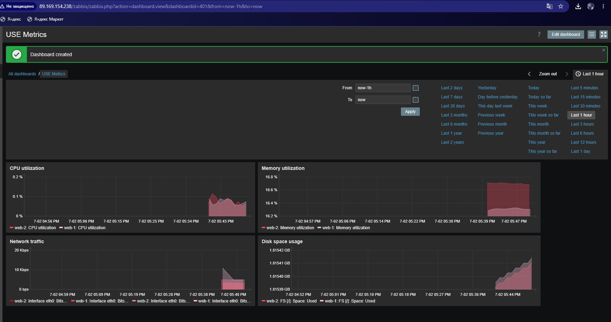

*Рис. 9 — Zabbix: пользовательский дашборд «USE Metrics». Отображаются 4 графика по принципу USE (Utilization, Saturation, Errors) для веб-серверов web-1 и web-2: загрузка CPU, использование памяти, сетевой трафик (Bits received/sent на интерфейсе eth0) и использование дискового пространства.*

### Triggers / Thresholds

Триггеры настроены через шаблон `Linux by Zabbix agent` и включают пороговые значения для CPU, RAM, дисков, сети, файловой системы.

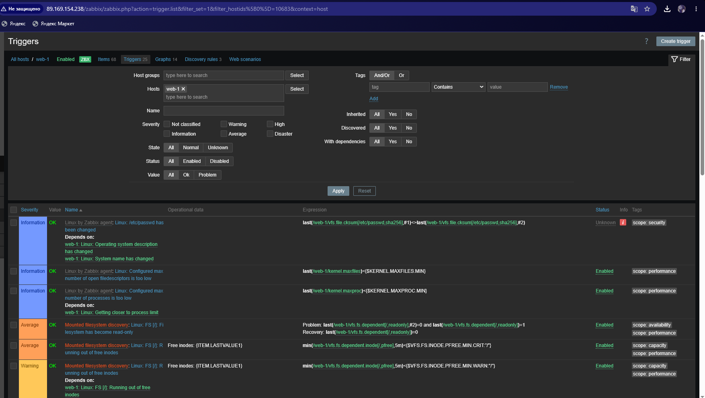

*Рис. 10 — Zabbix: список триггеров для хоста web-1 (25 триггеров). Настроены пороговые значения различных уровней severity: Information (изменение /etc/passwd, лимиты файловых дескрипторов и процессов), Average (файловая система read-only, критический уровень свободных inodes), Warning (предупреждение о свободных inodes). Все триггеры в состоянии OK.*

---

## Логи (Elasticsearch + Kibana)

### Elasticsearch

На ВМ `elastic` (192.168.20.25, приватная подсеть) развёрнут **Elasticsearch 8.19.18** в режиме single-node.

```json
{
  "name" : "elastic",
  "cluster_name" : "diplom-cluster",
  "version" : { "number" : "8.19.18" }
}
```

### Filebeat

На веб-серверах (`web-1`, `web-2`) установлен **Filebeat 8.19.18**, настроен на отправку:

- `/var/log/nginx/access.log`
- `/var/log/nginx/error.log`

Логи отправляются в Elasticsearch в индекс `filebeat-*`.

### Kibana

На ВМ `kibana` (51.250.78.121) развёрнута **Kibana 8.19.18**, подключена к Elasticsearch (192.168.20.25:9200).

Доступ к веб-интерфейсу: http://51.250.78.121:5601

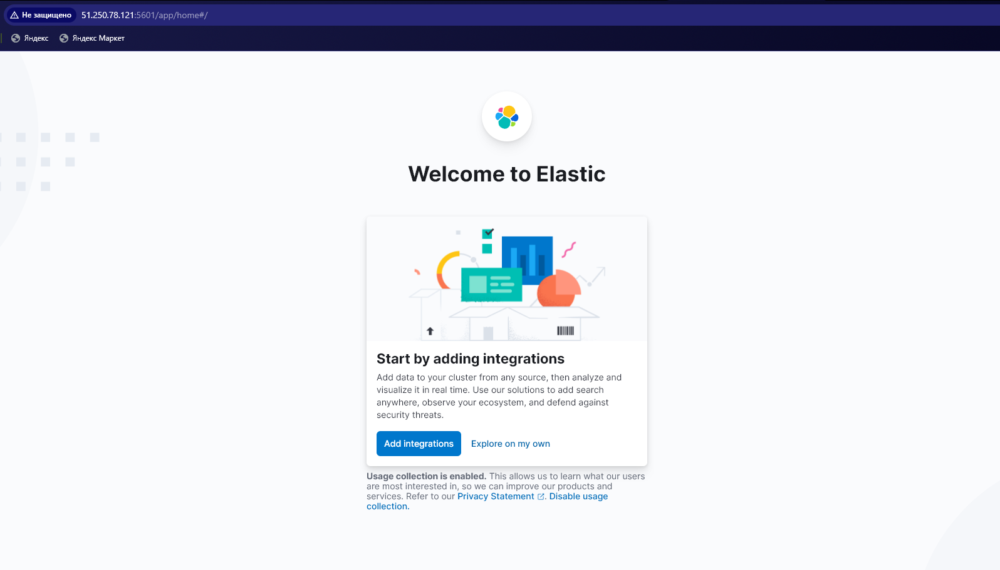

*Рис. 11 — Главная страница Kibana (Welcome to Elastic). Kibana успешно запущена и доступна по адресу http://51.250.78.121:5601. Подключение к Elasticsearch установлено.*

### Kibana Discover — логи nginx

Создан Data View `filebeat-*`. В Discover отображаются логи nginx access и error с обоих веб-серверов (2362 документа).

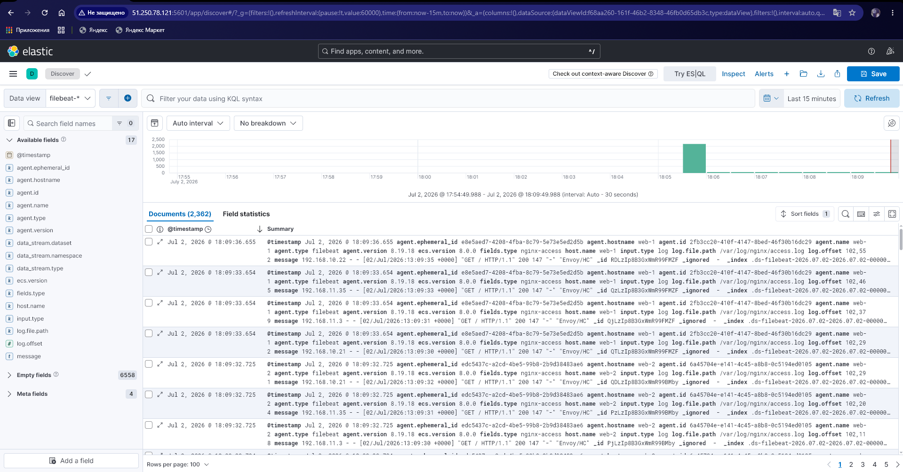

*Рис. 12 — Kibana: раздел Discover с Data View `filebeat-*`. Отображаются 2362 документа — логи nginx access.log с обоих веб-серверов (web-1 и web-2). Видны поля: @timestamp, agent.hostname, fields.type (nginx-access), host.name, log.file.path (/var/log/nginx/access.log), message (GET-запросы с кодом 200). Данные поступают с обоих серверов через Filebeat в Elasticsearch.*

---

## Резервное копирование

Настроено ежедневное создание **snapshot** дисков всех 6 ВМ по расписанию:

- **Время**: каждый день в 03:00 UTC
- **Хранение**: последние 7 снимков (неделя)
- **Диски**: bastion, web-1, web-2, zabbix, elastic, kibana

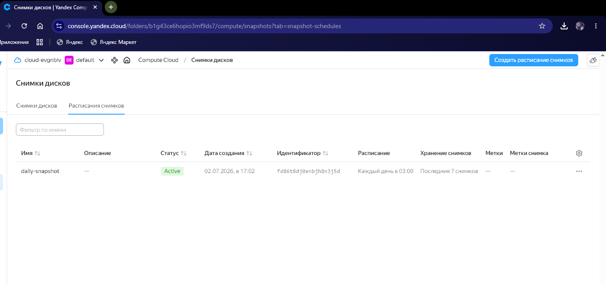

*Рис. 13 — Консоль Yandex Cloud: расписание снимков дисков. Расписание `daily-snapshot` в статусе Active, настроено на ежедневное создание снимков в 03:00 с хранением последних 7 снимков.*

---

## Terraform-файлы проекта


Все манифесты расположены в директории [terraform/](terraform/):

| Файл | Описание |
|---|---|
| [main.tf](terraform/main.tf) | Провайдер Yandex Cloud |
| [network.tf](terraform/network.tf) | VPC, подсети, NAT-шлюз, таблица маршрутизации |
| [security.tf](terraform/security.tf) | Security Groups для всех сервисов |
| [vms.tf](terraform/vms.tf) | Виртуальные машины (6 шт.) |
| [alb.tf](terraform/alb.tf) | Target Group, Backend Group, HTTP Router, ALB |
| [snapshots.tf](terraform/snapshots.tf) | Расписание снимков дисков |
| [outputs.tf](terraform/outputs.tf) | Выходные данные (IP-адреса) |

## Выходные данные Terraform

```
bastion_public_ip   = "93.77.182.96"
zabbix_public_ip    = "51.250.65.14"
kibana_public_ip    = "89.169.135.16"
alb_public_ip       = "158.160.216.69"
web1_internal_ip    = "192.168.20.16"
web2_internal_ip    = "192.168.21.34"
elastic_internal_ip = "192.168.20.25"
```

## Ansible-плейбуки

Все плейбуки расположены в директории [ansible/](ansible/):

| Плейбук | Описание |
|---|---|
| [hosts.ini](ansible/hosts.ini) | Инвентарь хостов |
| [nginx.yml](ansible/nginx.yml) | Установка nginx на web-1 и web-2 |
| [zabbix.yml](ansible/zabbix.yml) | Установка Zabbix Server + Frontend + PostgreSQL |
| [zabbix-agents.yml](ansible/zabbix-agents.yml) | Установка Zabbix Agent на все ВМ |
| [elastic.yml](ansible/elastic.yml) | Установка и настройка Elasticsearch |
| [kibana.yml](ansible/kibana.yml) | Установка и настройка Kibana |
| [filebeat.yml](ansible/filebeat.yml) | Установка Filebeat на веб-серверы |
---

## Доступ к ресурсам

| Ресурс | URL |
|---|---|
| Сайт (ALB) | http://158.160.216.69 |
| Zabbix | http://51.250.65.14/zabbix (Admin / zabbix) |
| Kibana | http://89.169.135.16:5601 |
