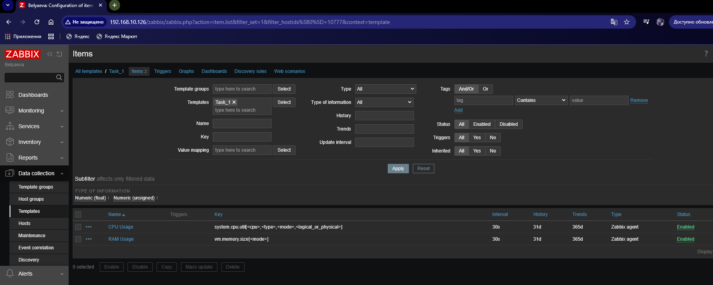
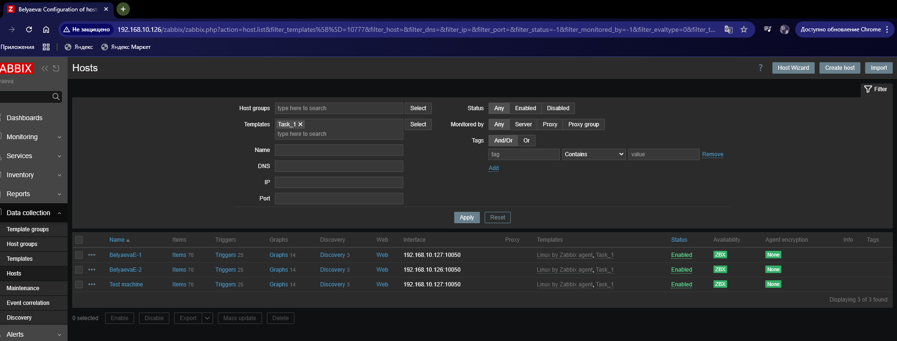
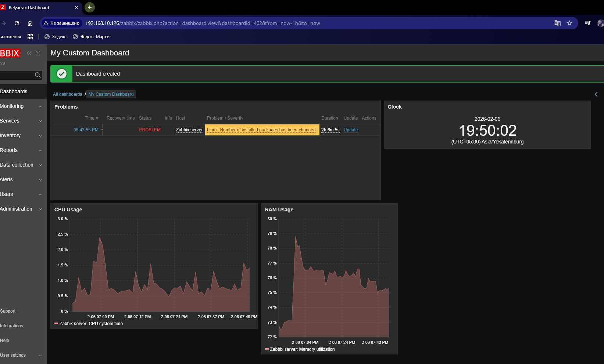

# Домашнее задание к занятию «Система мониторинга Zabbix. Часть 2»

**Беляева Евгения Олеговна**

---

## Задание 1

Создайте свой шаблон, в котором будут элементы данных, мониторящие загрузку CPU и RAM хоста.

### Результат выполнения

Скриншот страницы шаблона Task_1

---

## Задание 2-3

Добавьте в Zabbix два хоста и задайте им имена <фамилия и инициалы-1> и <фамилия и инициалы-2>. Например: ivanovii-1 и ivanovii-2.
Привяжите созданный шаблон к двум хостам. Также привяжите к обоим хостам шаблон Linux by Zabbix Agent.

### Результат выполнения

Скриншот страницы хостов, где видны привязки шаблонов с названиями.

---

## Задание 4

Создайте свой кастомный дашборд.

### Результат выполнения

Скриншот дашборда с названием My Custom Dashboard

