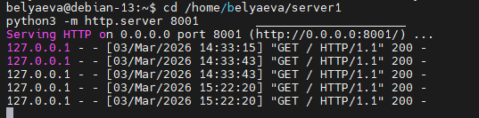
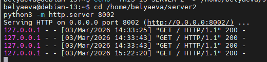
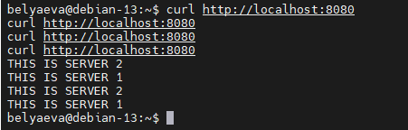
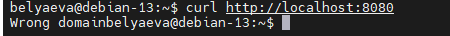
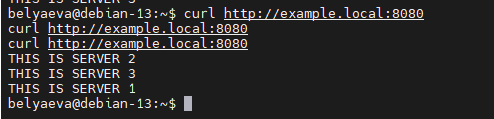
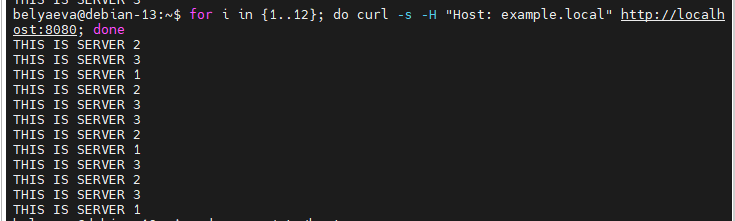

# Домашнее задание к занятию «Кластеризация и балансировка нагрузки»

**Беляева Евгения Олеговна**

---

## Задание 1

### Что нужно сделать

1. Запустите два simple python сервера на своей виртуальной машине на разных портах
2. Установите и настройте HAProxy, воспользуйтесь материалами к лекции
3. Настройте балансировку Round-robin на 4 уровне. 
4. На проверку направьте конфигурационный файл haproxy, скриншоты, где видно перенаправление запросов на разные серверы при обращении к HAProxy.

---

### Результат выполнения

Конфигурационный файл HAProxy с алгоритмом Round-robin на 4 уровне

```
global
        log /dev/log    local0
        log /dev/log    local1 notice
        chroot /var/lib/haproxy
        stats socket /run/haproxy/admin.sock mode 660 level admin
        stats timeout 30s
        user haproxy
        group haproxy
        daemon

        # Default SSL material locations
        ca-base /etc/ssl/certs
        crt-base /etc/ssl/private

        # See: https://ssl-config.mozilla.org/#server=haproxy&server-version=2.0.3&config=intermediate
        ssl-default-bind-ciphers ECDHE-ECDSA-AES128-GCM-SHA256:ECDHE-RSA-AES128-GCM-SHA256:ECDHE-ECDSA-AES256-GCM-SHA384:ECDHE-RSA-AES256-GCM-SHA384:ECDHE-ECDSA-CHACHA20-POLY1305:ECDHE->
        ssl-default-bind-ciphersuites TLS_AES_128_GCM_SHA256:TLS_AES_256_GCM_SHA384:TLS_CHACHA20_POLY1305_SHA256
        ssl-default-bind-options ssl-min-ver TLSv1.2 no-tls-tickets

defaults
        log     global
        mode    tcp
        option  tcplog
        timeout connect 5000
        timeout client  50000
        timeout server  50000

frontend python_front
    bind *:8080
    default_backend python_back

backend python_back
    balance roundrobin
    server server1 127.0.0.1:8001 check
    server server2 127.0.0.1:8002 check

```

Терминал 1


Терминал 2


Проверка через HAProxy

---


## Задание 2

### Что нужно сделать

1. Запустите три simple python сервера на своей виртуальной машине на разных портах
2. Настройте балансировку Weighted Round Robin на 7 уровне, чтобы первый сервер имел вес 2, второй - 3, а третий - 4
3. HAproxy должен балансировать только тот http-трафик, который адресован домену example.local
4. На проверку направьте конфигурационный файл haproxy, скриншоты, где видно перенаправление запросов на разные серверы при обращении к HAProxy c использованием домена example.local и без него.

---

### Результат выполнения

Конфигурационный файл HAProxy с балансировкой Weighted  Round robin на 7 уровне

```
global
        log /dev/log    local0
        log /dev/log    local1 notice
        chroot /var/lib/haproxy
        stats socket /run/haproxy/admin.sock mode 660 level admin
        stats timeout 30s
        user haproxy
        group haproxy
        daemon

        # Default SSL material locations
        ca-base /etc/ssl/certs
        crt-base /etc/ssl/private

        # See: https://ssl-config.mozilla.org/#server=haproxy&server-version=2.0.3&confi>
        ssl-default-bind-ciphers ECDHE-ECDSA-AES128-GCM-SHA256:ECDHE-RSA-AES128-GCM-SHA2>
        ssl-default-bind-ciphersuites TLS_AES_128_GCM_SHA256:TLS_AES_256_GCM_SHA384:TLS_>
        ssl-default-bind-options ssl-min-ver TLSv1.2 no-tls-tickets

defaults
        log     global
        mode    http
        option  httplog
        timeout connect 5000
        timeout client  50000
        timeout server  50000

frontend http_front
    bind *:8080

    # Проверяем заголовок Host
    acl is_example hdr_dom(host) -i example.local

    use_backend example_back if is_example

    default_backend default_back

backend example_back
    balance roundrobin
    server server1 127.0.0.1:8001 weight 2 check
    server server2 127.0.0.1:8002 weight 3 check
    server server3 127.0.0.1:8003 weight 4 check

backend default_back
    http-request return status 503 content-type text/plain string "Wrong domain"
```







SERVER 3 будет появляться чаще всего, потому что weight 4.

 


