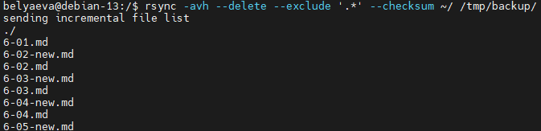
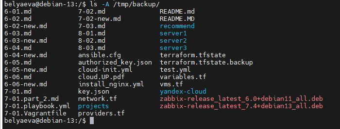
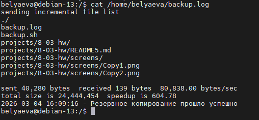

# Домашнее задание к занятию «Резервное копирование»

**Беляева Евгения Олеговна**

---

## Задание 1

### Что нужно сделать

- Составьте команду rsync, которая позволяет создавать зеркальную копию домашней директории пользователя в директорию /tmp/backup
- Необходимо исключить из синхронизации все директории, начинающиеся с точки (скрытые)
- Необходимо сделать так, чтобы rsync подсчитывал хэш-суммы для всех файлов, даже если их время модификации и размер идентичны в источнике и приемнике.
- На проверку направить скриншот с командой и результатом ее выполнения
---

### Результат выполнения

Скриншот команды запуска rsync



Результат выполнения копирования




---


## Задание 2

### Что нужно сделать

- Написать скрипт и настроить задачу на регулярное резервное копирование домашней директории пользователя с помощью rsync и cron.
- Резервная копия должна быть полностью зеркальной
- Резервная копия должна создаваться раз в день, в системном логе должна появляться запись об успешном или неуспешном выполнении операции
- Резервная копия размещается локально, в директории /tmp/backup
- На проверку направить файл crontab и скриншот с результатом работы утилиты.
---

### Результат выполнения

Скрипт для резервного копирования

```
#!/bin/bash

# Директория для резервной копии
SOURCE="/home/belyaeva/"
DESTINATION="/tmp/backup/"

# Файл для логирования
LOG_FILE="/home/belyaeva/backup.log"

# Дата и время для записи в лог
DATE=$(date '+%Y-%m-%d %H:%M:%S')

# Выполнение резервного копирования
rsync -avc --exclude='*/.*' --exclude='.*' $SOURCE $DESTINATION &>> $LOG_FILE

# Проверка, был ли успешным процесс
if [ $? -eq 0 ]; then
    echo "$DATE - Резервное копирование прошло успешно" >> $LOG_FILE
else
    echo "$DATE - Ошибка при резервном копировании" >> $LOG_FILE
fi

```
Содержимое команды crontab

```
0 2 * * * /home/belyaeva/backup.sh

```
Скриншот с результатом работы утилиты




